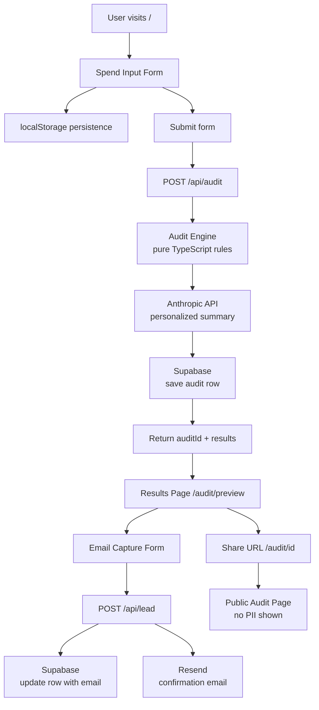

# Architecture

## System Diagram

## Data Flow

1. **Input → Audit:** User fills the spend form. State persists to
   localStorage on every change. On submit, form data is sent to
   POST /api/audit as AuditInput JSON.

2. **Audit → Result:** The audit engine runs as a pure TypeScript
   function — no AI, no network calls. It applies hardcoded rules
   per tool and returns an AuditResult with per-tool savings and
   recommendations. The API route then calls Anthropic to generate
   a 100-word personalized summary, with a templated fallback if
   the API call fails. The full result is saved to Supabase with a
   unique public_url_id.

3. **Result → Lead:** The results page shows instantly using the
   locally computed audit while the API call runs in the background.
   After seeing their results, the user optionally submits their
   email. The lead capture route updates the Supabase row with the
   email, and sends a confirmation email via Resend.

4. **Lead → Share:** Each audit has a unique public URL at
   /audit/[id]. This page fetches from Supabase and strips PII
   (email, company) before rendering. Open Graph tags are generated
   server-side for clean link previews.

## Why This Stack

**Next.js 14 (App Router):** Chosen for its unified full-stack model —
API routes, server components, and client components in one framework.
Eliminates the need for a separate backend. Prior experience with
Next.js from CryptoResto reduced ramp-up time significantly.

**TypeScript:** Enforces correctness on the audit engine where a type
error could mean wrong savings numbers shown to users. The
AuditInput → AuditResult pipeline is fully typed end to end.

**Supabase:** Postgres with a REST API and generous free tier. Chosen
over Firebase for SQL query flexibility — filtering audits by savings
threshold or date range for future analytics is straightforward.

**Resend:** Simplest transactional email DX available. Free tier covers
early scale. No domain verification needed for development with
onboarding@resend.dev sender.

**Vercel:** Zero-config deployment for Next.js. Automatic preview
deployments on every push made testing during the week faster.

**Tailwind CSS + shadcn/ui:** Utility-first styling with accessible
headless components. Faster to iterate than CSS modules. shadcn/ui
components are copied into the repo — no runtime dependency.

## What I Would Change at 10k Audits/Day

1. **Rate limiting:** Move from in-memory Map to Redis (Upstash) so
   rate limits survive server restarts and work across multiple
   instances.

2. **Audit API:** Add a job queue (BullMQ or Inngest) so the Anthropic
   API call runs asynchronously. Return the audit result immediately
   and stream the summary in when ready. This cuts perceived latency
   from ~3s to ~300ms.

3. **Supabase:** Add row-level security policies. Currently disabled
   for development speed — a production deploy needs RLS to prevent
   users from reading each other's audit data via the anon key.

4. **Caching:** Cache audit results for identical inputs (same tools,
   plans, seats, team size) with a 24-hour TTL. At scale, many users
   will have identical configurations.

5. **Analytics:** Add Posthog for funnel tracking. The North Star
   metric (audits completed/week) needs instrumentation to be
   actionable.