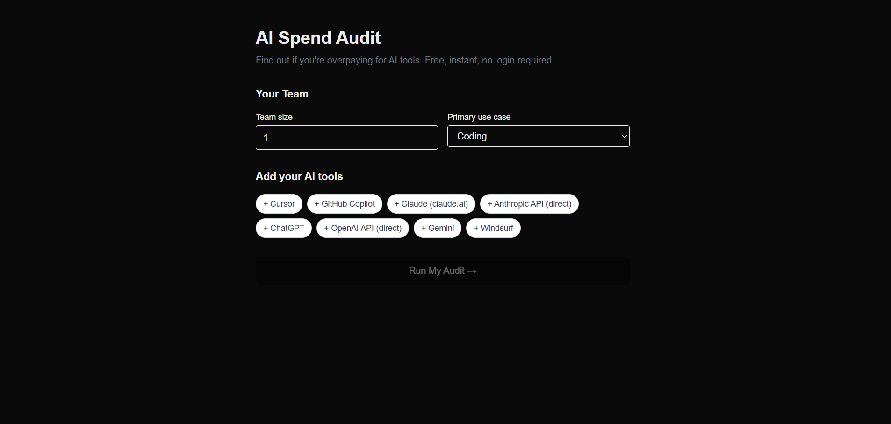

# AI Spend Audit

A free web app that audits your team's AI tool spend — Cursor, Claude,
ChatGPT, GitHub Copilot and more — and tells you exactly where you're
overpaying and what to switch to. Built as a lead generation tool for
[Credex](https://credex.rocks), a marketplace for discounted AI credits.

---

## Screenshots


---

## Live URL

prompt-ledger-zewt.vercel.app

---

## Quick Start

### Prerequisites
- Node.js 20+
- A Supabase project
- An Anthropic API key
- A Resend API key

### Install and run locally

```bash
git clone https://github.com/Ayushi-ninja/AI-Spend-Audit
cd promptledger
npm install
```

Create `.env.local`:
```env
NEXT_PUBLIC_SUPABASE_URL=your_supabase_url
NEXT_PUBLIC_SUPABASE_ANON_KEY=your_anon_key
ANTHROPIC_API_KEY=your_anthropic_key
RESEND_API_KEY=your_resend_key
RESEND_FROM_EMAIL=onboarding@resend.dev
NEXT_PUBLIC_APP_URL=http://localhost:3000
```

Run the Supabase migration:
```sql
create table audits (
  id uuid primary key default gen_random_uuid(),
  created_at timestamptz default now(),
  public_url_id text unique not null,
  audit_input jsonb not null,
  audit_result jsonb not null,
  email text,
  company_name text,
  role text
);
create index audits_public_url_id_idx on audits(public_url_id);
```

Start the dev server:
```bash
npm run dev
```

Open [http://localhost:3000](http://localhost:3000)

### Deploy to Vercel

```bash
npm install -g vercel
vercel
```

Add all environment variables in the Vercel dashboard under
Settings → Environment Variables.

---

## Decisions

**1. Audit engine is hardcoded rules, not AI.**
Using AI to decide whether a user should downgrade their Cursor plan
would produce inconsistent, hard-to-audit results. A finance person
needs to agree with the reasoning. Deterministic rules with cited
pricing data are more trustworthy and cheaper to run.

**2. Results shown before email capture.**
Every tool that gates results behind email loses 60–80% of users before
they see value. Showing the audit instantly and capturing email after
means users who give their email have already seen the savings number
and are genuinely interested.

**3. Local computation before API response.**
The audit engine runs in the browser immediately on form submit (<5ms).
The results page shows instantly while the Anthropic API call runs in
the background. This makes the app feel fast even though the full
round-trip takes 3–4 seconds.

**4. Supabase over Firebase.**
SQL query flexibility matters for future analytics — filtering audits
by savings threshold, tool combination, or team size requires joins
that are awkward in Firestore. Supabase also has a more generous free
tier for storage.

**5. Honeypot over hCaptcha for spam protection.**
hCaptcha adds friction for real users. A hidden form field that bots
fill but humans don't catches the majority of automated submissions
with zero UX cost. Rate limiting handles the rest.